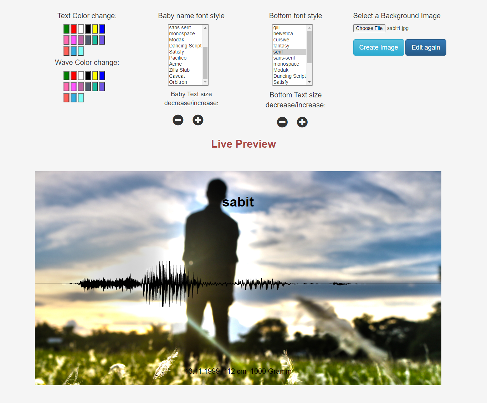

# Baby's_name

This is a web-application where user can enter there baby's name and some other info. Then it will generate the sound wave of that baby's name.
After that user can upload an image as a background and update some feature of it(font,color etc). Then user can download this as an image to his local device.
  
## Demo
 Live Link: https://babynametowave.herokuapp.com/
 
 

  

## Technology used
  
  * Node.js (Back-end)
  * HTML, CSS and Javascript(Front-end)
